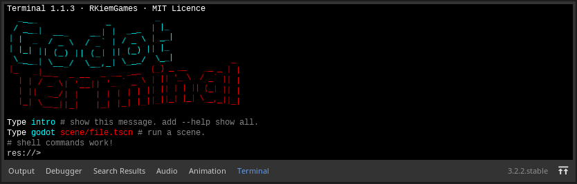

# Godot Terminal for Linux

This is a real GNU/Linux terminal for executing commands
and applications from command line:
`ls`, `cd`, piped commands, and others are supported.

* Can I to execute sudo? Yes, you can! We have an askpass shell script.
* Personalize foreground and background colors.
* `godot` command is a shortcut command to Godot command
  line tool, it can execute scenes and more!

Type help --all for to show more details.

# Screenshots

